# TensorLess: Hybrid Neural Interface

> **A scratch-built Java neural engine orchestrated by a modern Django control dashboard.**


---

## 📖 Overview

**TensorLess** is a proof‑of‑concept exploring a very real systems problem in scientific and financial computing:

> **How do you connect a high‑performance, compiled computation engine to a modern, human‑friendly interface—without burying everything under heavyweight frameworks?**

The goal was not to build a state-of-the-art model, but to understand and expose the mechanics of a neural network and its integration into a larger system.
* The neural network is implemented **entirely from scratch in Java** — matrix math, backpropagation, gradient descent.
* The model runs as a **persistent JVM microservice**, loaded once and kept hot.
* A **Django web dashboard** acts as the control room, handling user input, visualization, and orchestration.
* The two layers communicate via **raw TCP sockets**, not REST, not gRPC — just bytes and intent.

This mirrors how real production systems often evolve: legacy or performance‑critical backends paired with modern interfaces.

---

## 🎯 Motivation (The “Why”)

TensorLess is not about competing with deep‑learning frameworks. It is about **architecture literacy**.

* **Java Engine** — Represents the performance‑critical core: deterministic, type‑safe, fast, and explicit.
* **Django Dashboard** — Represents the UX layer: iteration speed, visualization, accessibility.
* **Socket Bridge** — Demonstrates low‑level IPC where latency, control, and simplicity matter more than abstraction.

This design intentionally avoids:

* JVM restarts per inference
* REST overhead for local IPC
* Black‑box ML libraries

---

## ⚙️ Technical Highlights

### 1️⃣ Core Neural Engine (Java)

* **Zero external dependencies**
  Built entirely on `java.util` and `java.io`.

* **Manual mathematics**
  Forward propagation, backpropagation, and gradient descent are implemented explicitly — no hidden tensors.

* **Configurable dense architecture**
  Current topology:

  ```
  784 (Input) → 128 (Hidden) → 64 (Hidden) → 10 (Output)
  ```

* **Binary persistence**
  Trained weights are serialized using `DataOutputStream` into lightweight `.bin` files for fast reloads.

---

### 2️⃣ Interoperability Layer (Raw TCP Sockets)

* **Persistent prediction server**
  `PredictorServer.java` runs an infinite loop on **Port 9999**, keeping the model resident in memory.

* **Minimal custom protocol**

  * **Input:**

    * One line
    * 784 comma‑separated pixel values (`0–255`)
  * **Output:**

    * Plain‑text key–value stream
    * Final prediction + confidence distribution

* **Defensive parsing**
  The server safely ignores invalid inputs (including stray HTTP health checks from hosting platforms).

This keeps the bridge debuggable with tools as simple as `netcat`.

---

### 3️⃣ Frontend & Control Room (Django + JavaScript)

* **Canvas preprocessing**
  An HTML5 canvas captures user input and applies a **center‑of‑mass normalization** to match MNIST training conditions.

* **Real‑time inference loop**
  Django streams pixel data to the Java engine and parses prediction responses synchronously.

* **Visualization pipeline**

  * Confidence distributions rendered using `matplotlib` (Agg backend)
  * Converted to Base64 and embedded directly in the response

The frontend never sees model internals — only intent and results.

---

## 🏗 System Architecture

TensorLess follows a **split‑stack architecture**. The JVM loads once, stays hot, and responds immediately — eliminating cold‑start latency common in CLI‑wrapped ML tools.

```mermaid
graph TD
    User([👤 User / Browser])
    Django[🐍 Django Web Server]
    Java[☕ Java Neural Engine]

    style User fill:#f9f,stroke:#333,stroke-width:2px
    style Django fill:#bbf,stroke:#333,stroke-width:2px
    style Java fill:#f96,stroke:#333,stroke-width:2px

    User -- "1. Draws Digit (HTTP POST)" --> Django

    subgraph "Server Side"
        Django -- "2. Sends Pixels (TCP :9999)" --> Java
        Java -- "3. Prediction + Confidences" --> Django
    end

    Django -- "4. JSON + Graph Response" --> User
```



---

## 🚀 Running Locally

### Prerequisites

* Java **JDK 11+**
* Python **3.8+**

---

### Step 1: Start the Java Neural Engine

The JVM server must be running before the web dashboard sends requests.

```bash
cd java_core

# Compile
javac -d bin src/*.java

# Run the persistent server (Port 9999)
java -cp bin PredictorServer
```

Expected output:

```
🚀 NEURAL SERVER STARTING ON PORT 9999
```

---

### Step 2: Launch the Django Dashboard

Open a second terminal:

```bash
pip install -r requirements.txt
python manage.py runserver
```

Then visit:

```
http://127.0.0.1:8000
```

---

## 🧠 Closing Notes

TensorLess is intentionally *uncomfortable* by modern standards. That is the point.

It forces you to confront:

* What a neural network actually computes
* How systems talk when abstractions are stripped away
* Where performance and ergonomics truly diverge

If you can reason about TensorLess, you can reason about almost any ML‑driven system that sits between legacy infrastructure and modern interfaces.

---

**Built to understand the machine — not hide it.**
